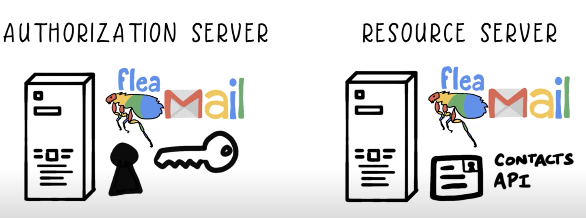

# Oauth2, OpenID, SAML

https://developer.okta.com/blog/2019/10/21/illustrated-guide-to-oauth-and-oidc

## Oauth v2.0

*Authorization:* You give one app a key that gives them specific permission to access your data or do things on your behalf in another application. 

You authorize one application to access your data or use features in another application, on your behalf, without giving them your password. 

### vocabulary

**Resource owner**: you (your identity, data)

**Client**: the application, eg, terrible pun of the day, that wants to do something on your behalf

**Authorization server:** Application where the resource owner already has an account (eg, gmail)

**Resource server**: Application that has the resource the client wants to use. May or may not be the same as the authorization server. 

**Redirect URI**: where the auth server will redirect the resource owner after granting permission to client. Also called *callback URL*.

**Response type**: The type of information the client expects to receive. The most common response type is **Code** (an authorization code)

**Scope**: The granular permissions the client wants. eg access to data or ability to perform certain actions. --> the aut server will verify with you, the resource owner, whether you consent to these permissions. 

**Client ID:** Used to identify the client with the authorization server. 

**Client secret**: secret pw that only the client and the authorisation server know. For securely/privately sharing info.

**Authorization code:** short-lived temp code that the authorization server sends back to the client. The client then sends this code back to the authorization server along with the secret, in exchange for an **access token**.

**Access token**: The key which the client will use from that point forward to communicate with the resource server. 

### oauth2 flow

client sends a request to authorization server with client id, redirect uri, response type, and scopes it wants

authorization server verifies who you are and if necessary asks for a login, then presents you with a consent form:

at this point the authorization server will redirect you to the redirect URI along with a temporary authorization code. 

The client then contacts the authorization server directly (not through your browser) and sends the previously received temp authorization code, its client id and the client secret. 

The authorization server verifies the data and responds with an access token. The client can then use this token to make requests to the resource server. 

NOTES:

The client ID and secret are generated by the authorization server when they establish the intraction between them. 

## OpenID connect

does *authentication*: enables a client to establish a login session, and also *identity*. 

thin layers that sits on top of oauth2.0 

When an authorization server supports OIDC it is often called an **identity provider**. 

Open ID connect enables SSO (single sign-on), ie scenarios where one login is used in multiple applications

Analogy: ATM machine is like a client, your card is like a token. 

### open id connect flow

same as for oauth2, except that a specific scope=openid is used. This tells the authorization server that this will be an open id connect exchange. 

Also, when the client exchanges its temporary auth code it receives back both an **access token** and an **id token**. 

--> the *access token*, as before, is a gibberish string the client doesn't understand

--> the *ID token* is a JSON web token or **JWT**, from which the client can extract identity info. The data in the ID Token are called **Claims**.

## OpenID connect in Docebo LMS

The configuration of the OpenID connect app (the first part of it) is as follows:

The **Platform URLs** values have to be copied into the configuration of the identity provider, while the **Open ID client** values have to be copied *from* the configuration of the identity provider. 

